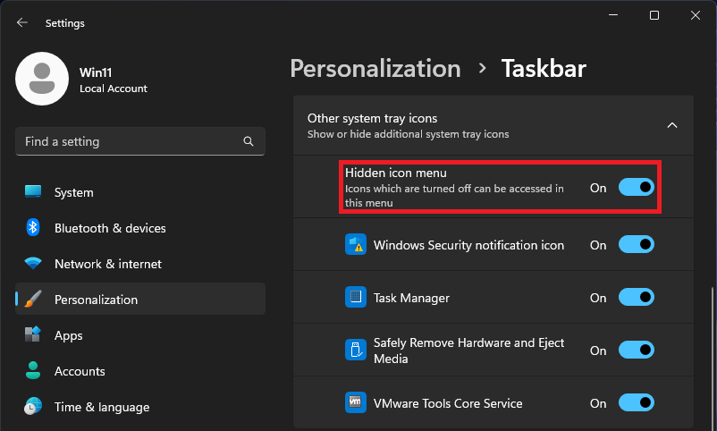

# "Always show all icons and notifications on the taskbar" fix v2
You no longer need to open "Settings > Personalization > Taskbar > Other system tray icons > [icon name] > Enable"

## Ukrainians continue to fight for their right to live.
**You can help us by donating to <a href="https://savelife.in.ua/en/donate-en/#donate-army-card-monthly" target="_blank">International charity foundation Come Back Alive</a> to save the lives of millions of Ukrainians who are still experiencing the horrors of war and continue to fight to protect not only themselves but also the whole of Europe.**    
*The organization does not use funds to purchase weapons. Its mission is solely to supply technology, training and ammunition to help save the lives of Ukrainians and help soldiers defend Ukraine.*

## How to install it?
Click on the green **Code** button, then **Download ZIP**.    
Unzip to a convenient folder for you and run installer.bat    
Administrator privileges are **not** required.

## How to remove it?
Run installer.bat again

## How to update to v2?
Run install.bat to uninstall the old version, and then run it again to install this version

## EnableAutoTray and explorer shell:::{...} don't work
It seems that in 24H2 Microsoft completely broke EnableAutoTray in the registry and control panel menu which can be opened using

    explorer shell:::{05d7b0f4-2121-4eff-bf6b-ed3f69b894d9}

## How does it work?
The installer moves the minified script to your user folder, hides it, and creates a special PowerShell shortcut in the startup folder that runs the script in the background.    
At startup, PowerShell asks Windows to notify it when the UI registers a new program and suspends itself. When the OS triggers it, the script enables ALL programs in the taskbar settings. However, enabling manually disabled programs in the settings can be avoided by changing one line of code (note that it is the minified version that is installed). By default, this is done to avoid problems if MS changes the algorithm for adding new programs.    

Recommendation: don't disable the *Hidden Icon Menu* option so that you can notice that new programs aren't automatically added to the taskbar if MS manages to break this script

## Does it affect PC performance?
When the script is in standby mode, it does **not** affect the CPU and requires only about 30 MB of RAM. When it is running (which is rare and takes less than a second), it uses **much less** than 1% of the CPU. To reduce the already tiny performance impact, a minified script is used and the process is assigned the lowest priority.

## Acknowledgment
Aemony from Reddit for the idea of using a registry event trigger